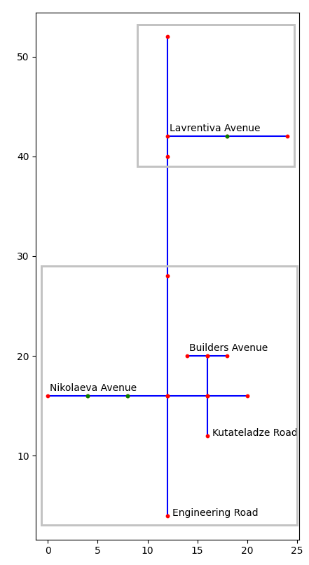
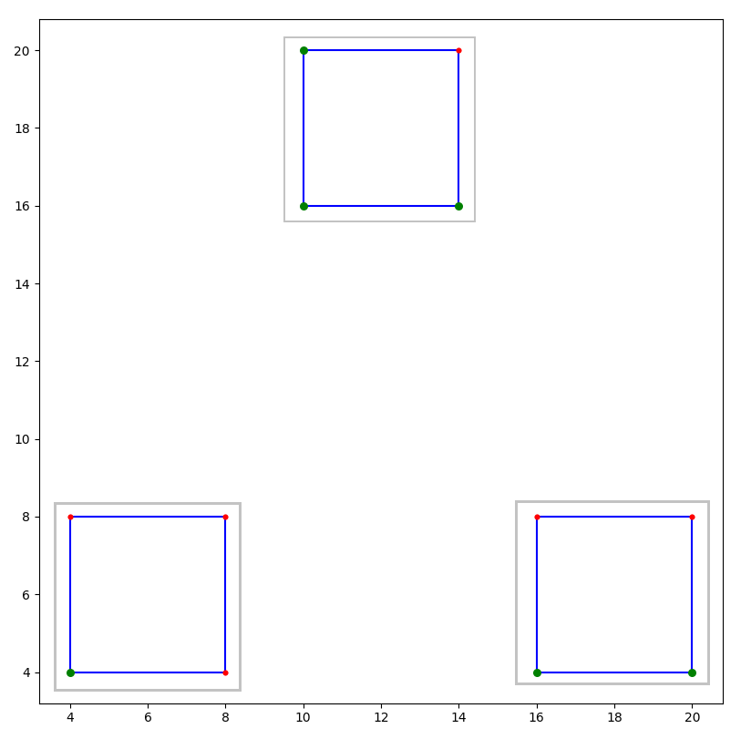

# Задача #4
### Вариант: 1
### Баллы: 7 + 3
## Условие:

**Базовая задача [7 баллов]**:

В этой задаче вам предстоит важная миссия: спасти великие мегаполисы пещерных гномов!

Народ гномов всегда славился своими огромными пещерными городами. Главной их особенностью всегда были идеально
прямые улицы и тоннели, которые пересекаются друг с другом только под углом 90 градусов. С другой стороны каждый
гномий мастер-строитель всегда хочет проявить свою индивидуальность, поэтому расстояние между домами на каждой из улиц 
может отличаться.

Другая важная особенность гномов в том, что они не могут жить без **пива**, это обязательный продукт, заменяющий гномам воду,
доступ к нему необходим в каждом доме. К сожалению, с поставками пива в последнее время огромные проблемы.

Но решение есть - это **пивопровод**, изобретение местных умельцев, которое доставит пиво в каждый дом.
Ваша же задача - помочь гномам-изобретателям подключить к **пивопроводу** весь город.
Это не так просто, как может показаться, ведь:

1. Подключать город к пивопроводу нужно по **районам**, один за другим. Заранее список районов вам неизвестен, гномы абсолютно не хотят делиться такой информацией с чужаком. Единственное, чем гномы решили поделиться - это информацией об улицах пещерного города (формат этой информации приведен ниже);
2. Чем больше в районе домов, тем дольше его подключать к пивопроводу;
3. Наконец, на некоторых улицах пещерного города встречаются **таверны**. Это особое священное место для любого гнома, отсутствие пива там считается смертельным оскорблением. Поэтому, чем больше в районе таверн, тем больше жители ждут подключения к пивопроводу, и тем больше они злятся, что их район все еще не подключен. А вы, поверьте, совершенно не хотите их злить.

Ваша задача выбрать порядок районов для подключения так, чтобы минимизировать злость гномов из-за отсутствия в их районе
пивопровода.

Поможет вам в этой задаче знание жадных алгоритмов. Ведь вы случайно узнали, что районы в городе гномов объявляются по
правилам **single-link** кластеризации домов (в качестве расстояния между домами стоит использовать евклидову метрику,
т.к. пивопровод можно проложить не только по улицам, но и напрямую).  А минимизация злости гномов смутно напоминает вам
задачу **планирования** с одним исполнителем.  

--

**Дополнительная задача [3 балла]**:  

Раз уж вы все равно будете искать районы мегаполиса гномов, то гномий бригадир попросил вас сделать карту города: визуализировать
все дома, таверны, улицы и районы города гномов. Каждый район должен быть отмечен своим цветом, подписывать улицы необязательно.

## Формат входных и выходных данных:
В первой строке входного файла записаны три числа: *N* - количество районов в городе, *S* - количество улиц в городе, *T* - количество таверн.

В следующих *S* строках идет описание улицы в формате:

`prefix` `street_type` `start_x` `start_y` `number_of_houses` `distance_between_houses`

Здесь:

- `prefix` `<street_type` - это название улицы. `street_type` - принимает одно из двух значений: `Road` - значит улица идет строго на север (т.е. у последующих домов растет координата `y`), `Avenue` - значит улица идет строго на восток (т.е. у последующих домов растет координата `x`),
- `start_x` `start_y` - координаты начала улицы, т.е. первого дома на ней,
- `number_of_houses` `distance_between_houses` - количество домой на улице и расстоянием между ними соответственно. `number_of_houses` больше либо равно двум. `distance_between_houses` - целое число. 

Наконец, в следующих *T* строках идут адреса таверн в формате:

`street_name`, `number_of_house`

где `street_name` - имя улицы, состоящее из префикса и типа, а `number_of_house` - дом на этой улице (нумерация у гномов, конечно, идет с нуля). 

--

В выходном файле нужно написать одно число: суммарную злость гномов от задержек подключения пивопровода при
оптимальном выборе районов и порядка их подключения.

## Пример входных и выходных данных:

| input                                                                                                                                                                                                                                                                                                                                                                                                                                                                         | output | Пример визуализации           |
|-------------------------------------------------------------------------------------------------------------------------------------------------------------------------------------------------------------------------------------------------------------------------------------------------------------------------------------------------------------------------------------------------------------------------------------------------------------------------------|:-------|-------------------------------|  
| 2 5 3   Nikolaeva Avenue 0 16 6 4   Engineering Road 12 4 5 12   Kutateladze Road 16 12 3 4   Builders Avenue 14 20 3 2   Lavrentiva Avenue 12 42 3 7   Nikolaeva Avenue, 1   Nikolaeva Avenue, 2   Lavrentiva Avenue, 1                                                                                                                                                                                                                      | 39     |  |
|||
| 3 12 6   First Avenue 4 4 2 4   Second Avenue 4 8 2 4   First Road 4 4 2 4   Second Road 8 4 2 4   Third Avenue 12 4 2 4   Fourth Avenue 12 8 2 4   Third Road 12 4 2 4   Fourth Road 16 4 2 4   Fifth Avenue 8 12 2 4   Sixth Avenue 8 16 2 4   Fifth Road 8 12 2 4   Sixth Road 12 12 2 4   First Avenue, 0   Third Avenue, 0   Third Avenue, 1   Fifth Avenue, 0   Fifth Avenue, 1   Fifth Road, 1 | 40     |  |

## Система тестирования:
Для прохождения автоматических тестов вам нужно адаптировать **Makefile** в репозитории под свои нужды в зависимости от того,
какой язык вы используете для решения задачи. Для этого нужно обновить значение переменной **RUNNABLE**, указав там то,
что будет запускаться для тестирования. И при необходимости добавить шаги по сборке вашего решения.

В закомментированной части **Makefile** вы можете увидеть два примера: для языков Python и C.

## Замечания к реализации:
1. Возможно вы захотите начать с визуализации, чтобы глазами видеть получающиеся районы. Это может быть очень полезно в отладке базовой части задачи.
2. Если вы используете Python для реализации задачи, рекомендуется посмотреть в сторону `numpy` и `scipy` для подготовки данных. Иначе этот этап может занять внушительное время. Чтобы эти пакеты заработали, раскомментируйте соответствующие строчки в `setup.sh` (или добавьте любые другие, нужные вам).